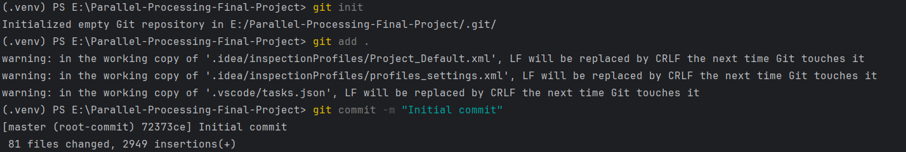
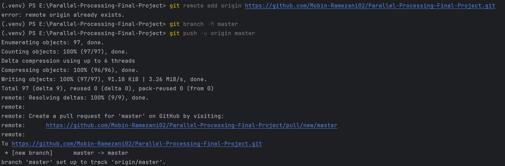

# Parallel-Processing-Final-Project


# اتصال پروژه به GitHub

این راهنما مراحل اتصال یک پروژه محلی به ریپازیتوری GitHub را نشان می‌دهد.  
فرض بر این است که Git روی سیستم نصب شده باشد.

### 1. ساخت ریپازیتوری در GitHub

1. وارد حساب GitHub شوید.
2. روی دکمه **New Repository** کلیک کنید.
3. یک نام انتخاب کنید و ریپازیتوری را **Public** یا **Private** بسازید.
4. آدرس (URL) ریپازیتوری را کپی کنید (HTTPS یا SSH).


### 2. آماده‌سازی پروژه روی سیستم

داخل پوشه پروژه در ترمینال:

```bash
git init
git add .
git commit -m "Initial commit"

```


### 3. اتصال به ریپازیتوری GitHub
```bash
git remote add origin <URL>
```
مثال :
git remote add origin https://github.com/username/repo-name.git

### 4. ارسال کد به GitHub

```bash
git branch -M master
git push -u origin master
```

نمونه اجرای دستورات اتصال پروژه به GitHub :


---


# داکرایز کردن پروژه
### 1. پیش‌نیازها

نصب **Docker** و **Docker Compose v2**

ساخت فایل‌های: `Dockerfile`، `.dockerignore`


### 2. `.dockerignore`

فایل‌های غیرضروری وارد ایمیج نشوند:

```
.git
.gitignore
node_modules
dist
build
__pycache__
*.pyc
.env
.env.*
.vscode
.idea
```

---


**requirements.txt**
```
fastapi[all]==0.109.0
uvicorn[standard]==0.27.0
gunicorn==21.2.0
```

**Dockerfile**
```
# For more information, please refer to https://aka.ms/vscode-docker-python
FROM python:3-slim

EXPOSE 8000

# Keeps Python from generating .pyc files in the container
ENV PYTHONDONTWRITEBYTECODE=1

# Turns off buffering for easier container logging
ENV PYTHONUNBUFFERED=1

# Install pip requirements
COPY requirements.txt .
RUN python -m pip install -r requirements.txt

WORKDIR /app
COPY . /app

# Creates a non-root user with an explicit UID and adds permission to access the /app folder
# For more info, please refer to https://aka.ms/vscode-docker-python-configure-containers
RUN adduser -u 5678 --disabled-password --gecos "" appuser && chown -R appuser /app
USER appuser

# During debugging, this entry point will be overridden. For more information, please refer to https://aka.ms/vscode-docker-python-debug
CMD ["gunicorn", "--bind", "0.0.0.0:8000", "-k", "uvicorn.workers.UvicornWorker", "FastAPI.main:app"]

```
---

### 3. Build و Run

**Build:**
```bash
docker build -t myfastapi:latest .
```

**Run:**
```bash
docker run -p 8000:8000 myfastapi:latest
```

حالا سرویس روی آدرس زیر در دسترس است:
```
http://localhost:8000
```

